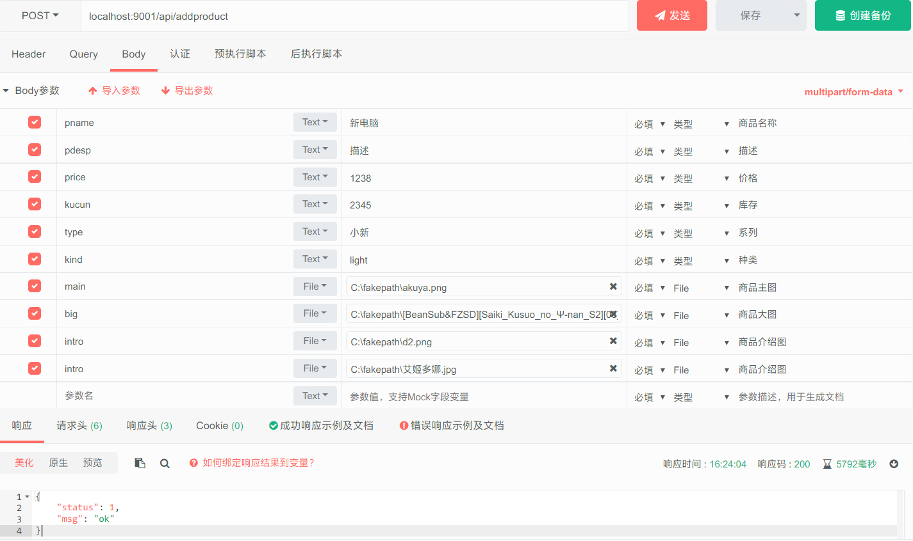

# API
功能描述|方法|地址|参数|参数说明|返回数据结构
-|-|-|-|-|-|
查询所有用户|GET|getalluser|-|-|-|-|{status:0/1,msg:"",data\[{user},{user}]
用户删除|POST|deluser|uid|用户id|-|-|{status:0/1,msg:""}
查询所有订单|GET|getallorder|-|-|-|-|{status:0/1,msg:"",data\[{order},{order}]
订单更新|POST|updateorder|status/recvname/phone/detail/orid|订单状态/收货人姓名/手机号/详细地址/订单号|-|-|{status:0/1,msg:""}
获取所有商品|GET|getallproduct|-|-|-|-|{status:0/1,msg:"",data\[{product},{product}]
商品增加|POST|addproduct|pname/pdesp/peizhi/price/kucun/type/kind/pid|商品名称/商品描述/商品配置/价格/库存/系列/种类，可选{light,game,Thinkpad}/商品pid|-|-|{status:0/1,msg:""}
商品增加（图片）|POST|addproduct|main/big/intro/pid|主图/大图/详情图/商品的pid|-|-|{status:0/1,msg:""}
商品更新|POST|updateproduct|pname/pdesp/peizhi/price/kucun/type/kind/pid|商品名称/商品描述/商品配置/价格/库存/系列/种类，可选{light,game,Thinkpad}/商品pid|-|-|{status:0/1,msg:""}
商品更新（图片）|POST|updateproduct|main/big/intro/pid|主图/大图/详情图/商品的pid|-|-|{status:0/1,msg:""}
商品删除|POST|delproduct|pid|商品id|-|-|{status:0/1,msg:""}

## 实体类及其成员变量
user成员变量|说明|类型
-|-|-|
uid|用户id|int
uname|用户名|string
email|用户邮箱|string
phone|用户手机号|string
yue|余额|int
status|用户状态(是否有效）|int
creatime|创建时间|string
updatime|更新时间|string

product成员变量|说明|类型
-|-|-|
pid|商品id|string
pname|商品名称|string
pdesp|商品描述|string
peizhi|配置|string
kucun|库存|int
price|价格|int
type|系列|string
kind|类型（light/game/Thinkpad)|string
sellcount|卖出计数|int
status|状态(是否有效）|int
linkid|图片位于此名称的目录下|int
creatime|创建时间|string
updatime|更新时间|string

order成员变量|说明|类型
-|-|-|
oid|订单id|string
uid|用户id|int
count|数量|string
pid|商品id|string
aprice|单价|int
status|状态|string
pname|商品名称|string
peizhi|配置|string
uname|用户名|string
linkid|图片文件夹|int
recvname|收货人姓名|string
phone|收货人手机号|string
detailed|收货人地址|string
creatime|创建时间|string
updatime|更新时间|string

文件夹下为部分API返回的示例,基本上有data的返回就文件夹下的三个，其他只返回类似于下面的两项，其中 status 表示请求是否成功，msg 为相关信息
```json
{
    "status":1,
    "msg":"ok"
}
```
下图(1.png)为添加商品的一个请求示例




